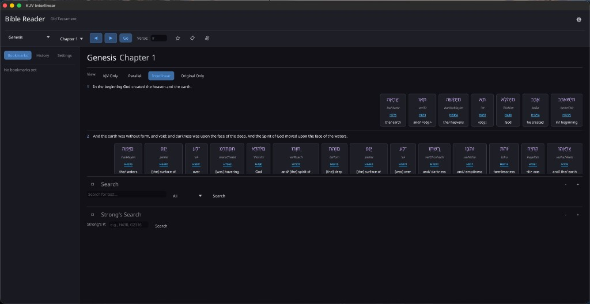

# KJV-Interlinear

A KJV Bible study app with Hebrew and Greek interlinear support, built in Rust with [egui](https://github.com/emilk/egui).

KJV-Interlinear extends a fast KJV reader with original language texts, Strong's concordance, lexicon lookups, bookmarks, reading history, and a polished theme system — all in a native desktop app.



## Features

- **KJV Reading** — Chapter-by-chapter navigation across all 66 books
- **Hebrew & Greek Interlinear** — Word-by-word original language text aligned with the KJV, parsed from STEP Bible data (TAHOT, TAGNT)
- **Strong's Concordance** — Every Hebrew and Greek word linked to its Strong's number with occurrence counts and cross-references
- **Lexicon** — Built-in Hebrew (TBESH) and Greek (TBESG) dictionary entries with definitions, transliterations, and morphology
- **Red Letter** — Words of Christ highlighted from a verse-accurate quote map (Gospels, Acts, Revelation)
- **Display Modes** — KJV only, parallel, interlinear, or original-language-only views
- **Search** — Full-text search with scope filtering (all, current book, Old Testament, New Testament)
- **Bookmarks & History** — Save verses and track your reading with persistent storage
- **Theming** — Dark and light modes with semantic colors for Hebrew, Greek, red-letter text, and Strong's links
- **Settings** — Configurable font sizes, transliteration display, morphology toggling, and more — all saved between sessions

## Building

Requires [Rust](https://rustup.rs/) (edition 2024).

```sh
cargo build --release
```

Run from the project root (so `old_testament/`, `new_testament/`, and `data/` are found):

```sh
cargo run --release
```

| Directory | Contents |
|---|---|
| `old_testament/` | KJV Old Testament text files (one per book) |
| `new_testament/` | KJV New Testament text files (one per book) |
| `data/` | STEP Bible original language files and red-letter map (optional for core reading — interlinear features need STEP files) |

Parsed original-language data is cached under your OS cache directory after the first load.

## Data Sources & Attribution

See [NOTICE](NOTICE) for full attribution text.

- **KJV text**: [Project Gutenberg](https://www.gutenberg.org/) eBook #10 — see [licenses/PROJECT_GUTENBERG.txt](licenses/PROJECT_GUTENBERG.txt)
- **Hebrew OT / Greek NT / lexicons**: [STEP Bible](https://www.STEPBible.org/) (TAHOT, TAGNT, TBESH, TBESG), [CC BY 4.0](https://creativecommons.org/licenses/by/4.0/) — [STEPBible-Data](https://github.com/STEPBible/STEPBible-Data)
- **Red-letter words of Christ**: [kjvstudy.org](https://github.com/kennethreitz/kjvstudy.org) by Kenneth Reitz (ISC License)

## Project Structure

```
src/
├── main.rs                  # App entry point
├── lib.rs                   # Library root
├── models.rs                # Bible, Verse, ExtendedBible, Strong's types
├── parsing.rs               # KJV text file parser
├── paths.rs                 # Asset path resolution
├── red_letter.rs            # Words-of-Christ index
├── settings.rs              # Persistent settings, bookmarks, history
├── theme.rs                 # Semantic dark/light theme system
├── fonts.rs                 # Bundled Noto Hebrew/Greek fonts
├── original_languages/
│   ├── mod.rs
│   ├── loader.rs            # STEP Bible TSV parser
│   └── cache.rs             # Binary cache for ExtendedBible
└── ui/
    ├── mod.rs
    ├── app.rs               # Main app state and update loop
    └── components.rs        # Reusable UI components
```

## License

Application source code is licensed under the [MIT License](LICENSE).

Bundled data remains under its own terms (Project Gutenberg, STEP Bible CC BY 4.0, and ISC for the red-letter map) as described in [NOTICE](NOTICE).
