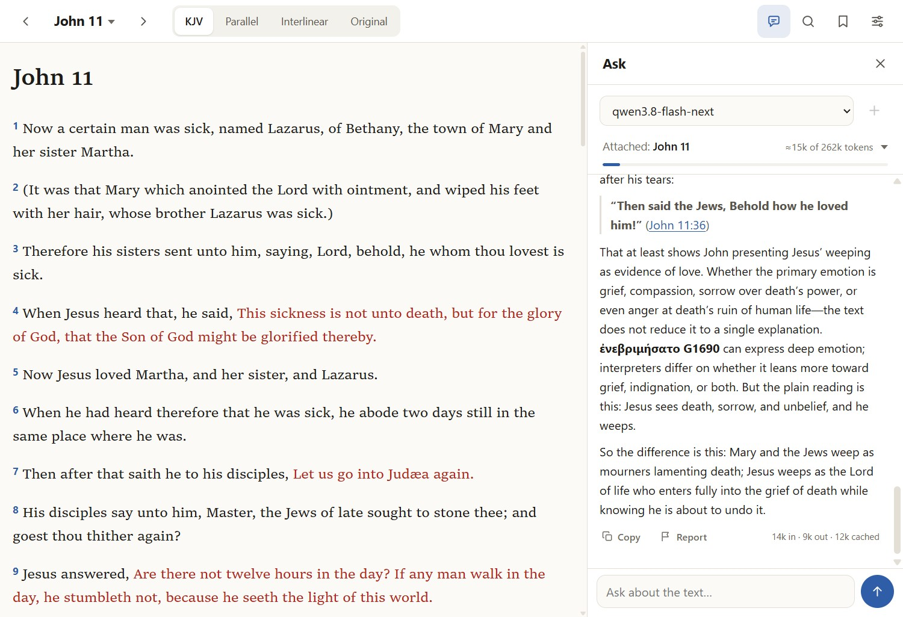
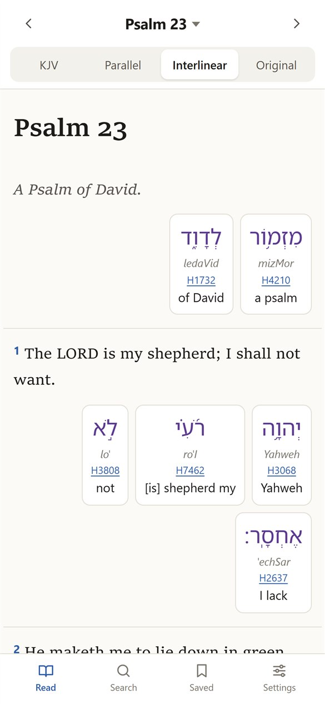
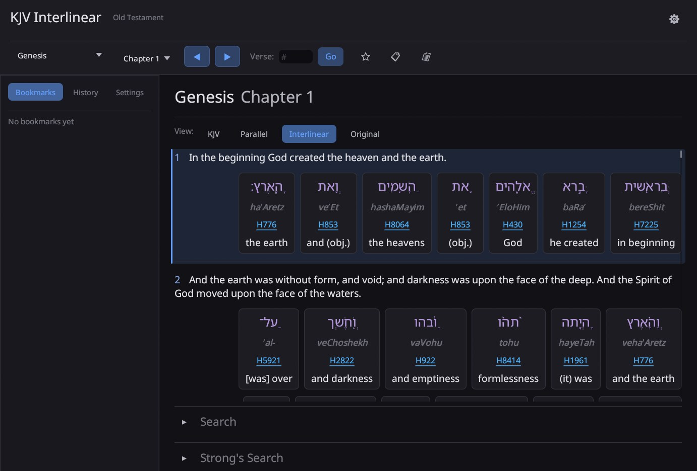

# KJV Interlinear

A King James Bible with the Hebrew and Greek behind every verse, for Windows, macOS, Linux, iPhone and iPad, and Android. Built with Rust and [Tauri](https://tauri.app/).





## Features

- **KJV text**: all 66 books in the 1769 standard text, including the Psalm titles
- **Hebrew & Greek interlinear**: every verse and Psalm title, word by word, with transliteration, Strong's number, grammar, and gloss
- **Four views**: KJV, Parallel (KJV beside the original), Interlinear, and Original only
- **Strong's & lexicon**: tap any word for its Hebrew (TBESH) or Greek (TBESG) dictionary entry and every verse that uses it
- **Red letter**: the words of Christ, taken span-for-span from the 1769 edition's own markup
- **Search**: live search across all books, one book, or one testament, with matches highlighted; `Caesar's` finds `Cæsar’s`
- **Study assistant (optional)**: ask about a verse, a chapter, chosen books, or the whole Bible with the text attached (and, if you like, every verse's Hebrew or Greek words with Strong's numbers). Use your own AI: a server on your network (vLLM, Ollama, LM Studio, llama.cpp) or your API key for Anthropic, OpenAI, Gemini, DeepSeek, OpenRouter, or Groq. It shows whether the passage fits the model's context window, streams the model's reasoning apart from the answer, links every reference it cites, and keeps keys in the system keychain. Conversations are saved on the device to reopen and continue later, with starred favourites and a history you can clear. Long answers never pull the page out from under you: it follows new text only while you're at the bottom
- **Bookmarks & history**, **light and dark themes**, adjustable text size and font
- **Private**: fully offline, no accounts, no tracking; the assistant talks only to the provider you set up ([privacy policy](PRIVACY.md))

<br clear="right">



## Following the text the KJV translated

- **Greek** follows the Textus Receptus (Scrivener 1894). Words found only in modern editions are left out, TR readings replace differing words, and TR-only verses such as Acts 8:37 and 1 John 5:7 are included.
- **Hebrew** follows the Masoretic text with the Qere readings, as the KJV does. Words reconstructed from the Septuagint are left out.
- **Versification** matches the KJV, including Psalm titles (verse 0 in Hebrew), Malachi 4, and the New Testament verse-boundary differences.

## Keyboard shortcuts (desktop)

| Keys | Action |
|---|---|
| ← / → | Previous / next chapter (crosses book boundaries) |
| Ctrl+F | Search |
| Ctrl+J | Ask the study assistant |
| Esc | Deselect, close the panel, or clear search highlights |
| Ctrl+B | Bookmark the selected verse |
| Ctrl+C / Ctrl+Shift+C | Copy the selected verse / the whole chapter |

Click or tap a verse to select it.

## Building

Requires [Rust](https://rustup.rs/) and the [Tauri CLI](https://tauri.app/start/prerequisites/) (`cargo install tauri-cli --version "^2"`). On Linux, also install the [WebKitGTK prerequisites](https://tauri.app/start/prerequisites/#linux).

```sh
cargo tauri dev          # run the app (from the app/ directory)
cargo tauri build        # installers for this platform
cargo test --release -p kjv-core -p kjv-ai   # data, API, and assistant tests
```

The app's build script compiles all the text and Hebrew/Greek data into one compressed bundle (about 6.6 MB) that is embedded in the app, so it needs no data files at runtime.

To work on the interface in a browser with the real data:

```sh
cargo run --release -p kjv-devserver   # then open http://localhost:1420
```

Release builds for every platform (Windows, macOS universal, Linux, Android, iOS) run in GitHub Actions when a `v*` tag is pushed; see [docs/RELEASING.md](docs/RELEASING.md).

## Project structure

```
crates/core/      Text, Hebrew/Greek loader, search, red letter, and the app's API (Rust)
  tests/          Data checks over every verse, word, lexicon link, and red-letter span
crates/ai/        Study assistant: streaming client for OpenAI-compatible, Anthropic, and Gemini APIs
crates/devserver/ Browser preview server for UI work
app/              Tauri app: embeds the data bundle and serves the UI
ui/               The interface: HTML, CSS, and JavaScript modules (no build step)
tests/ui/         Headless-Chrome UI test and a stand-in model server for it
old_testament/    KJV text, one file per book, "chapter:verse text" (Psalm titles are verse 0)
new_testament/
data/             STEP Bible Hebrew/Greek files, lexicons, and the words of Christ
```

## Data sources

See [NOTICE](NOTICE) for full attribution.

- **KJV text and words of Christ**: the 1769 standard text, public domain, via [CrossWire](https://crosswire.org/) / [eBible.org](https://ebible.org/find/details.php?id=eng-kjv)
- **Hebrew OT, Greek NT, lexicons**: [STEP Bible](https://www.STEPBible.org/) (TAHOT, TAGNT, TBESH, TBESG), [CC BY 4.0](https://creativecommons.org/licenses/by/4.0/). Source: [STEPBible-Data](https://github.com/STEPBible/STEPBible-Data)
- **Fonts**: Noto Sans and Noto Sans Hebrew (SIL Open Font License)

## License

Application source code is licensed under the [MIT License](LICENSE). Bundled data remains under its own terms as described in [NOTICE](NOTICE).
